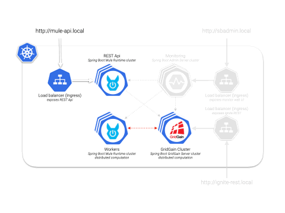
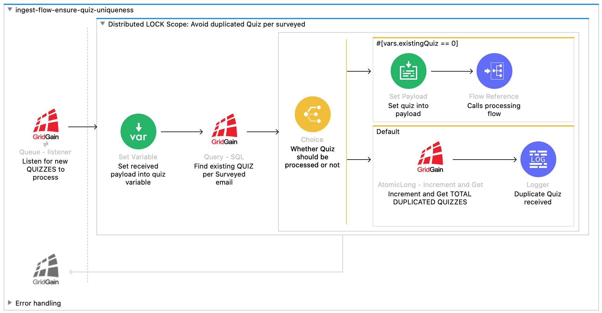
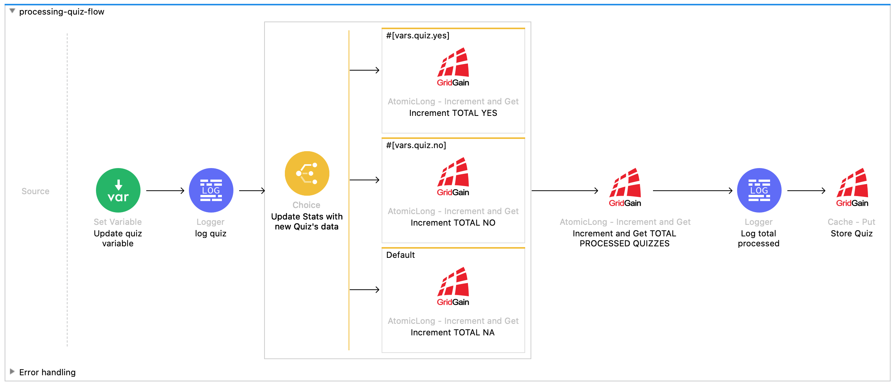

# Worker Mule Application

Workers will listen on a distributed Queue for new Quizzes to process:
- Avoiding more than one Quiz per surveyed (**distributed LOCK scope**).
- Updating Quizzes with additional data.
- Storing Quizzes into GridGain's **distributed database** (SQL Query Entity).
- Updating global stats.



Mule flow to listen on distributed Queue for new Quizzes to process, ensuring uniqueness:



Mule flow to process Quizzes:



## Ignite Configuration for Kubernetes

Configure IP finder on [ignite-config.xml](src/main/resources/ignite-config.xml) as `org.apache.ignite.spi.discovery.tcp.ipfinder.kubernetes.TcpDiscoveryKubernetesIpFinder` with the **kubernetes service name** to find server nodes and the **namespace**.

```xml
 <bean id="ignite-config" class="org.apache.ignite.configuration.IgniteConfiguration">
    ...

    <!-- Explicitly configure TCP discovery SPI -->
    <property name="discoverySpi">
      <bean class="org.apache.ignite.spi.discovery.tcp.TcpDiscoverySpi">
        <property name="ipFinder">
          <!--
          Enables Kubernetes IP finder and set namespace and service name (cluster) to find SERVER nodes.
          -->
          <bean class="org.apache.ignite.spi.discovery.tcp.ipfinder.kubernetes.TcpDiscoveryKubernetesIpFinder">
            <property name="shared" value="true" />
            <property name="namespace" value="my-mule4-stack" />
            <property name="serviceName" value="ignite-cluster-one-service" />
          </bean>
        </property>
      </bean>
    </property>

    ...
</bean>
```

## Kubernetes artifacts

- Namespace `my-mule4-stack`, service `ignite-cluster-one-service` and service `mule-worker-app-service` for discovery and spring management are defined in [k8s configuration yaml for mandatory artifacts](../kubernetes/1-mandatory.yaml)
- Will be started as a micro-service using [Spring Boot Mule 4 Runtime CE docker image](../spring-boot-mule4-runtime-ce/README.md), see [StatefulSet configuration yaml for Worker](../kubernetes/7-statefulset-mule-worker-app.yaml)

# Build Mule application

Build application:

```bash
mvn clean package
```

